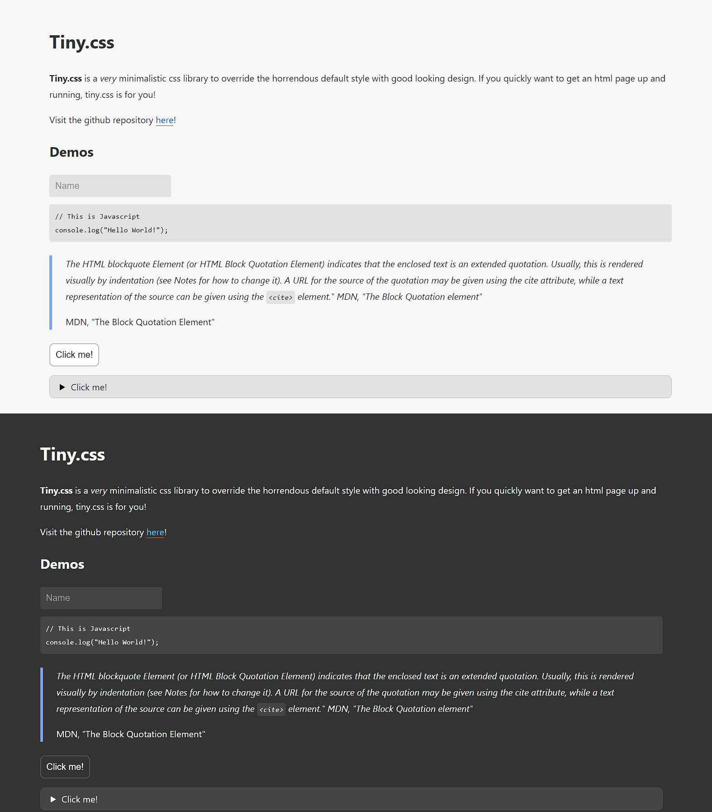

<a href="https://ihsan6133.github.io/tinycss"></a>

# Tiny.css

A very tiny css library to quickly build a webpage.

- [https://ihsan6133.github.io/tinycss](https://ihsan6133.github.io/tinycss)



## Why?

The default styles in modern browsers look absolutely displeasing. I find myself wanting to create
a quick html page, only to spend thirty minutes setting up the basic styles. Tiny.css provides basic
but good looking styles for a webpage.

## Installation

Just stick this in the `<head>` tag of your html file:

### Automatic light/dark theme:

```html
<link rel="stylesheet" href="https://cdn.jsdelivr.net/npm/tiny.css@0.12/dist/tiny.css">
```

### Light theme only:

```html
<link rel="stylesheet" href="https://cdn.jsdelivr.net/npm/tiny.css@0.12/dist/light.css">
```

### Dark theme only:

```html
<link rel="stylesheet" href="https://cdn.jsdelivr.net/npm/tiny.css@0.12/dist/dark.css">
```

## Contributing

Please feel free to contribute to this project! I am open to any suggestions and improvements.
If you find a bug, please open an issue.

## Inspiration

This project was inspired by [Kognise](https://kognise.dev/)'s [Water.css](https://watercss.kognise.dev/)
and [Guilherme Pangnotta](https://github.com/setetres)'s [evenbettermotherfucking.website](https://evenbettermotherfucking.website/).


## License

This project is licensed under the MIT license.

